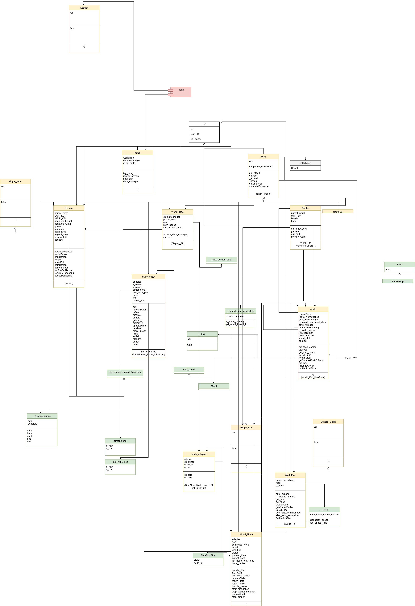

# World Line Simulator


<div align="center">
  
  <!--(https://app.codacy.com/gh/adi-g15/worldLineSim?utm_source=github.com&utm_medium=referral&utm_content=adi-g15/worldLineSim&utm_campaign=Badge_Grade)-->
  <!--  --> 
  <!--)](https://www.deepcode.ai/app/gh/adi-g15/worldLineSim/_/dashboard?utm_content=gh%2Fadi-g15%2FworldLineSim)-->
  <!--)](https://www.codefactor.io/repository/github/adi-g15/worldlinesim)-->
  <br/>
  <!--)](https://github.com/adi-g15/worldLineSim/actions/workflows/cmake_ubuntu.yml)-->
  <!--)](https://github.com/adi-g15/worldLineSim/actions/workflows/cmake_win.yml)-->
</div>

_Think about a world, in which entities keep moving (or any other action, eg. Human moving towards a location).

The idea is, that at any `time*` the universe has some state; You go back in time, change anything, this causes the current state to change, and hence the present and the future (as future depends on previous states)._

With such case, since there are two (or more) possible possibilities/events, the worldline/timeline **diverges**, and now there exists two (or more) worldlines/timelines, one in which the particular event happened, one where something else happened.

> Anime: https://wikiless.tiekoetter.com/wiki/Steins;Gate_(TV_series)

* It has a 3D auto expanding space, like a simple form of our universe
* You can now have as many entities as memory allows, and can CREATE your own entities too.
* Generalises the idea to entities and actions, in different worlds and worldlines, all independently on different threads, as well theoretically different verses too
* Parts of this codebase became small libraries for specific tasks, such as matrices

> It currently doesn't have 3D rendering, since that wasn't of importance earlier, the theoretical implementation was the goal, but it's interesting,
think of the very basic idea as this ->

## Building

First do a **recursive clone**, then

```sh
cd build   # if doesn't exist, then create
cmake ..
cmake --build .
```

## Creating your own Custom ENTITIES (for example, horses)

* Inherit from the Entity class, override/implement the `startSimulation` and `pauseSimulation` virtual member functions, and others that are pure virtuals, and need to be overloaded in Entity class

* In `World` constructors, make sure your push your new entities to the entities vector with `entities.push_back(new Horse(this));`

> Constructor - An entities constructor takes in the World*, so that it has access to the worldplot (consider it the space fabric here, just a matrix), for eg, calling `world->getRandomCoord()` to get a position in the world
> See the constructor of other entity, for eg. Human, Rock, Snake for reference

## Class Diagram

> Many entities have been added after this, leaving it so, as it clarifies the base things
>
> Made with draw.io



## Future Ideas

> There have been lots of ideas, all just in code, from now on, adding here, what i think...

* 3D Rendering ->
  Currently, EVERYTHING happens, and is correctly simulating, devs working on this maybe satisfied, though actually being able see them moving will absolutely be a great thing

* Sparse Matrix for space ->
  Currently it uses the graphMat library for the 3D matrix, ie, the space here, in current scenario a sparse data structure will be more beneficial

> 3D Rendering wasn't the aim at beginning; Developed graphMat as dense matrix as per the eariler needs, they have slightly changed with the current ways entities exist

## Source of Idea

  Steins Gate (Anime)

  and...

  My Interest, and thinking 😎😎


:copyright: Aditya Gupta 2020
